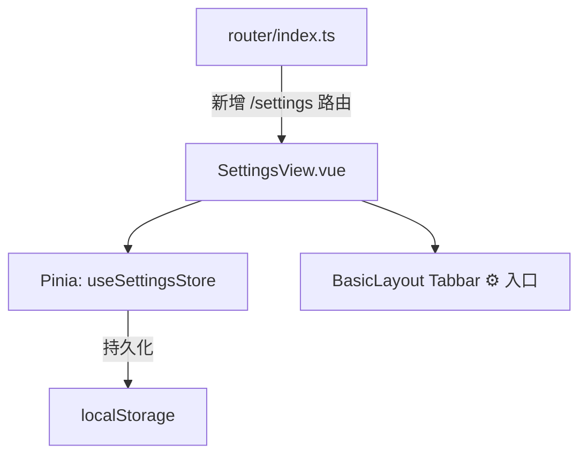

# High-Level Design — Settings 页面

> 面试题库 · Bagujing 项目

---

## 1. 项目现状概览

### 1.1 技术栈

| 层级 | 技术 | 版本 |
|------|------|------|
| **前端框架** | Vue 3 (Composition API, `<script setup>`) | 3.5 |
| **构建工具** | Vite | 7.2 |
| **路由** | vue-router (HTML5 History) | 4.6 |
| **状态管理** | Pinia | 3.0 |
| **CSS 方案** | UnoCSS (presetUno + presetAttributify + presetIcons) + 自定义 CSS | 66.x |
| **HTTP 客户端** | Axios (封装 `request.ts`，含缓存 / 拦截器 / Sentry) | 1.13 |
| **语言** | TypeScript | 5.9 |
| **后端** | Express.js 5 + SQLite3 + Redis (可选) | — |
| **监控** | Sentry + 阿里云 RUM | — |
| **图标** | @iconify-json/carbon (通过 UnoCSS presetIcons) | — |
| **部署** | PM2 (ecosystem.config.cjs) | — |

### 1.2 目录结构

```
frontend/src/
├── App.vue                # 根组件，仅 <RouterView />
├── main.ts                # 入口：Pinia + Router + Sentry
├── router/index.ts        # 路由配置
├── layouts/
│   └── BasicLayout.vue    # 通用布局：Header + Breadcrumb + Content + Tabbar
├── views/                 # 页面级组件
│   ├── CategoryList.vue   # 首页 — 分类列表
│   ├── ProblemDetail.vue  # 题目详情 (Split-pane)
│   ├── ProblemItem.vue    # 单题视图
│   ├── ProblemList.vue    # 题目列表
│   ├── AiAssistant.vue    # AI 助手
│   ├── AuditLogs.vue      # 审计日志
│   └── VirtualListDemo.vue
├── components/            # 可复用组件
├── api/                   # API 模块 (typed)
│   ├── categoryList.ts
│   ├── problemList.ts
│   └── problemItem.ts
├── stores/                # Pinia stores
│   ├── breadcrumb.ts
│   └── counter.ts
├── utils/
│   ├── request.ts         # Axios 封装 (GET/POST/PUT/DELETE + 缓存)
│   ├── ai-auth.ts         # AI 签名
│   └── breadcrumb.ts
├── interfaces/
│   └── query.ts           # 通用 QueryParams
└── monitoring/            # Sentry 初始化
```

### 1.3 当前路由配置

| 路径 | Name | 组件 |
|------|------|------|
| `/` | `category-list` | `CategoryList.vue` |
| `/problem-detail` | `problem-detail` | `ProblemDetail.vue` |
| `/demo/virtual-list` | `demo-virtual-list` | `VirtualListDemo.vue` |
| `/assistant` | `ai-assistant` | `AiAssistant.vue` |
| `/admin/audit` | `admin-audit` | `AuditLogs.vue` |

所有路由均为 `BasicLayout` 的子路由。

### 1.4 BasicLayout 结构

```
┌─────────────────────────┐
│  Header (面试题库 h-12)  │
│  ─ Breadcrumb (可选 h-8) │
├─────────────────────────┤
│                         │
│   Content (<RouterView>)│
│   flex-1 / scroll       │
│                         │
├─────────────────────────┤
│  Tabbar (h-14 / 仅首页)  │
└─────────────────────────┘
```

底部 Tabbar 目前仅有**首页**一个入口 (`/`)。

---

## 2. Settings 页面设计

### 2.1 目标

在现有项目中新增 `/settings` 路由，提供一个纯前端的**用户偏好设置**页面。内容可包括：

- **外观设置**：深色模式开关
- **字体大小**：滑动条调节
- **缓存管理**：清除 API 缓存按钮
- **关于**：版本号、技术栈信息

### 2.2 架构图



### 2.3 新增 / 修改文件清单

| 操作 | 文件 | 说明 |
|------|------|------|
| **新增** | `src/views/SettingsView.vue` | Settings 页面组件 |
| **新增** | `src/stores/settings.ts` | 设置项 Pinia store（含 localStorage 持久化） |
| **修改** | `src/router/index.ts` | 添加 `/settings` 路由 |
| **修改** | `src/layouts/BasicLayout.vue` | 底部 Tabbar 增加"设置"图标入口 |
| **修改** | `src/assets/main.css` | 增加 dark mode CSS 变量 (可选) |

### 2.4 关键设计决策

1. **纯前端** — 无需后端 API，所有设置项通过 `localStorage` + Pinia 持久化。
2. **复用项目风格** — 延续 UnoCSS utility class + `<script setup lang="ts">` 的写法。
3. **Tabbar** — 给底部 Tabbar 增加齿轮图标 (`i-carbon-settings`) 跳转 `/settings`。
4. **响应式** — 复用 `BasicLayout` 的 `md:max-w-[1280px]` 约束，在 PC 和移动端均良好展示。
