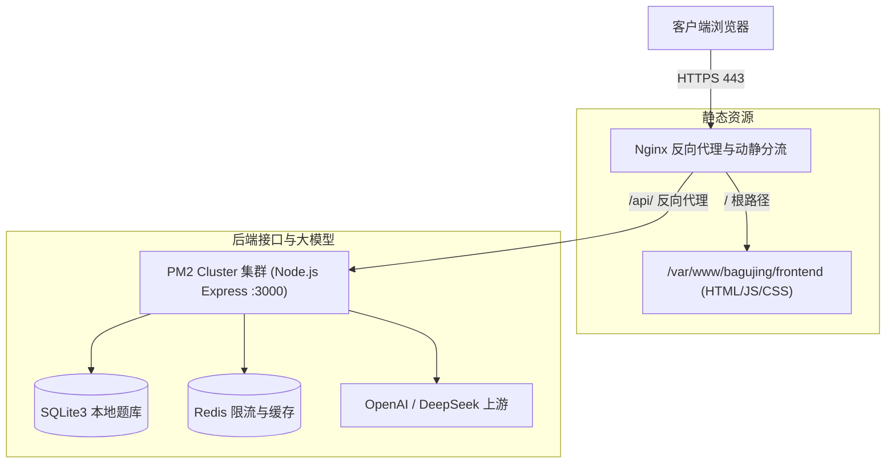

# DevAsk 生产部署与运维工程白皮书 (Deployment & Operations)

> 本文档详细记录了 DevAsk (职问AI) 在真实生产环境与发版验收阶段的完整运维架构、AWS EC2 部署指南、Nginx 动静分离配置、PM2 进程集群调优与定制静态服务器环境变量参数字典。

---

## 目录

- [1. 生产架构概览](#1-生产架构概览)
- [2. AWS EC2 + Nginx 一键自动化部署](#2-aws-ec2--nginx-一键自动化部署)
- [3. 生产环境变量清单配置](#3-生产环境变量清单配置)
- [4. Nginx 生产反向代理配置](#4-nginx-生产反向代理配置)
- [5. PM2 进程集群与生命周期管理](#5-pm2-进程集群与生命周期管理)
- [6. 前端定制静态服务器配置参考 (static-server.js)](#6-前端定制静态服务器配置参考-static-serverjs)

---

## 1. 生产架构概览

DevAsk 生产环境采用 **Nginx 动静分离 + PM2 Node.js 集群** 的工业级标准架构：



- **静态资源直接托管**：前端构建产物（`dist/`）由 Nginx 在内核层直接响应文件读取，具备最高的并发承载力和零 Node.js 内存开销。
- **动态请求反向代理**：Nginx 承接 HTTPS SSL/TLS 证书终止，将 `/api/*` 请求透明代理至本地 PM2 集群，并针对 AI SSE 流式输出（`text/event-stream`）禁用缓冲。

---

## 2. AWS EC2 + Nginx 一键自动化部署

### 一键部署脚本

项目在 `scripts/` 目录下提供了开箱即用的自动化部署脚本：

```bash
./scripts/deploy.sh
```

#### 该脚本执行的标准工作流：
1. **环境检查**：检查并全局安装 PM2 及其日志轮转插件（`pm2-logrotate`）；
2. **前端构建与分发**：编译前端生产代码并将静态产物同步发布至 `/var/www/bagujing/frontend`；
3. **安全证书部署**：校验 SSL 证书并将证书复制到系统标准目录 `/etc/nginx/ssl/bagujing/`；
4. **后端集群重启**：热重载并更新 PM2 Node.js 守护进程；
5. **Nginx 配置与重载**：自动建立 Nginx 站点配置软链接，执行语法检查（`nginx -t`）并热重载（`systemctl reload nginx`）。

---

## 3. 生产环境变量清单配置

在生产部署前，必须基于模板创建生产配置文件：

```bash
# 后端生产环境配置
cp backend/.env.example backend/.env

# 前端生产构建配置
cp frontend/.env.example frontend/.env.production
```

### 后端生产环境关键配置清单（`backend/.env`）

| 配置项 | 必填 | 默认值 / 示例 | 说明 |
| :--- | :---: | :--- | :--- |
| `PORT` | 否 | `3000` | 后端服务内部监听端口 |
| `OPENAI_API_KEY` | **是** | `sk-xxxxxx` | 大模型服务商 API Key（如 DeepSeek 或 OpenAI） |
| `OPENAI_BASE_URL` | 否 | `https://api.deepseek.com` | 大模型 API Base URL |
| `OPENAI_MODEL` | 否 | `deepseek-chat` | 生产大模型模型标识 |
| `AI_CLIENT_CREDENTIALS` | **是** | `web:strong_secret_token` | 客户端签名通信凭据，需与前端保持一致 |
| `AI_ALLOWED_ORIGINS` | 否 | `https://your-domain.com:*` | 允许访问 AI 接口的前端 Origin 白名单 |
| `JWT_SECRET` | 否 | 随机强字符串 | 用户身份认证 Token 密钥（生产强烈建议修改） |
| `ENABLE_SQLITE` | 否 | `true` | 是否启用 SQLite 本地数据库 |
| `REDIS_URL` | 否 | `redis://localhost:6379` | Redis 连接地址（用于分布式限流与缓存） |

---

## 4. Nginx 生产反向代理配置

Nginx 生产配置文件模板位于 [`deploy/nginx.conf`](../deploy/nginx.conf)。

### 手动部署与载入步骤：

```bash
# 1. 复制配置文件到 Nginx 可用站点目录
sudo cp deploy/nginx.conf /etc/nginx/sites-available/bagujing

# 2. 创建软链接启用站点
sudo ln -sf /etc/nginx/sites-available/bagujing /etc/nginx/sites-enabled/bagujing

# 3. 检查语法并重载服务
sudo nginx -t && sudo systemctl reload nginx
```

### 核心配置要点解析：

```nginx
# 1. 前端 SPA 静态托管与 History 路由回退
location / {
    root /var/www/bagujing/frontend; 
    index index.html index.htm;
    try_files $uri $uri/ /index.html =404;
}

# 2. 后端 API 反向代理与 SSE 流式防缓冲
location /api/ {
    proxy_pass http://127.0.0.1:3000;
    
    proxy_set_header Host $host;
    proxy_set_header X-Real-IP $remote_addr;
    proxy_set_header X-Forwarded-For $proxy_add_x_forwarded_for;
    proxy_set_header X-Forwarded-Proto $scheme;
    
    # 针对 AI SSE 流式输出的关键优化
    proxy_buffering off;
    proxy_read_timeout 120s;
}
```

---

## 5. PM2 进程集群与生命周期管理

配置文件位于 [`ecosystem.config.cjs`](../ecosystem.config.cjs)。针对低配置云服务器（如 AWS EC2 t3.small 2C2G）进行了精细的水位调优：
- **内存水位阈值**：`max_memory_restart: "600M"`，防止 Node.js 内存泄露压垮系统。
- **实例调度**：按 CPU 核心数启动 Worker 进程，保障平滑重载。

### 常用 PM2 运维命令：

```bash
# 启动生产服务
pm2 start ecosystem.config.cjs

# 查看所有运行进程状态
pm2 list

# 查看实时聚合日志
pm2 logs

# 修改配置后平滑重启并更新环境变量
pm2 restart bagujing-be-prod --update-env

# 停止服务
pm2 stop ecosystem.config.cjs

# 删除 PM2 托管进程
pm2 delete ecosystem.config.cjs

# 设置开机自启（首次在服务器部署时执行）
pm2 startup
pm2 save
```

---

## 6. 前端定制静态服务器配置参考 (static-server.js)

在发版前验收或无 Nginx 权限的本地环境中，项目通过定制的 [`scripts/static-server.js`](../scripts/static-server.js) 启动静态托管与反向代理。

### 启动命令：

```bash
PM2_SERVE_PATH=./frontend/dist \
PM2_SERVE_PORT=8080 \
PM2_SERVE_SPA=true \
STATIC_API_PROXY_ENABLED=true \
STATIC_API_PROXY_TARGET=http://127.0.0.1:3000 \
node scripts/static-server.js
```

### 全量环境变量字典：

#### 基础配置（兼容 pm2 serve 命名）

| 环境变量 | 默认值 | 说明 |
| :--- | :--- | :--- |
| `PM2_SERVE_PATH` | `./dist` | 静态文件根目录（通常指向 `./frontend/dist`） |
| `PM2_SERVE_PORT` | `8080` | HTTP 监听端口 |
| `PM2_SERVE_SPA` | `false` | 设为 `true` 时，未命中静态文件的路径会回退到 `index.html`（SPA 必需） |
| `PM2_SERVE_HOST` | `0.0.0.0` | 绑定的主机地址 |

#### API 反向代理

| 环境变量 | 默认值 | 说明 |
| :--- | :--- | :--- |
| `STATIC_API_PROXY_ENABLED` | `true` | 是否启用 API 反向代理 |
| `STATIC_API_PROXY_PREFIX` | `/api` | 需要代理的路径前缀 |
| `STATIC_API_PROXY_TARGET` | `http://127.0.0.1:3000` | 后端 API 服务地址 |
| `STATIC_API_PROXY_TOTAL_TIMEOUT_MS` | `30000` | 普通 API 请求总超时时间（毫秒） |
| `STATIC_API_PROXY_IDLE_TIMEOUT_MS` | `65000` | SSE 长连接空闲超时时间（毫秒） |

#### Cache-Control（差异化缓存策略）

| 环境变量 | 默认值 | 说明 |
| :--- | :--- | :--- |
| `STATIC_CACHE_HTML` | `no-cache` | HTML 文件的缓存策略（确保发版即时生效） |
| `STATIC_CACHE_ASSETS` | `public, max-age=31536000, immutable` | 带 Hash 的构建产物（如 `assets/index-xxxx.js`）1年强缓存 |
| `STATIC_CACHE_DEFAULT` | `public, max-age=3600` | 非 Hash 的普通静态资源默认缓存策略 |

#### 安全头与 CSP（内容安全策略）

| 环境变量 | 默认值 | 说明 |
| :--- | :--- | :--- |
| `STATIC_SECURITY_HEADERS` | `true` | 是否添加基础安全响应头（`X-Content-Type-Options` 等） |
| `STATIC_CSP` | *(自动生成)* | 覆盖完整 CSP 字符串；设为 `off` 可禁用 CSP |
| `STATIC_CSP_CONNECT_SRC` | *(空)* | 追加 `connect-src` 白名单（空格或逗号分隔） |
| `STATIC_CSP_REPORT_ONLY` | `false` | 设为 `true` 时仅上报不拦截（`Report-Only`） |

#### 预压缩与文件访问

| 环境变量 | 默认值 | 说明 |
| :--- | :--- | :--- |
| `STATIC_PRECOMPRESSED` | `true` | 优先直传同名 `.br` / `.gz` 预压缩文件，不消耗运行时 CPU |
| `STATIC_DOTFILES` | `deny` | 是否禁止访问 `.*` 隐藏文件（`deny` / `allow`） |
