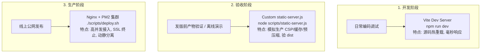

# 静态服务器 (static-server.js) 的演进历程与架构定位

> 本文记录了 Bagujing 项目静态托管方案的**真实演进过程**、各阶段面临的工程痛点，以及 `scripts/static-server.js` 在当前三层服务体系中的精准定位。

---

## 1. 架构演进的三部曲

### 阶段一：早期「纯 PM2 极简部署」时期的现实痛点

在项目早期，为了追求极简部署，团队曾尝试**仅依赖 PM2** 托管所有前后端服务（即后端跑 `server-express.js`，前端通过 `pm2 serve ./frontend/dist 8080 --spa` 启动托管）。

在此阶段，团队遭遇了三大致命缺陷：
1. **API 调用报 `405 Method Not Allowed`**：
   - 静态前端以同源相对路径调用接口（例如 `fetch('/api/chat', { method: 'POST' })`）。
   - 原生 `pm2 serve` 纯粹只做静态文件伺服，完全不支持代理转发，收到非 `GET/HEAD` 请求直接报错 `405`。
2. **大模型 SSE 流式输出卡顿与资源泄露**：
   - AI 助教的回答基于 Server-Sent Events (SSE) 长连接流式输出。原生静态服务器无法对流式响应做“禁用缓冲 (`no-store`)”处理，极易导致数据积压后一次性吐出。
   - 用户提前关闭浏览器标签时，缺乏上游连接清理机制，大模型在后端依然无效空转消耗 Token。
3. **一刀切的缓存策略导致线上发版事故**：
   - 无法智能区分 `index.html`（需要 `no-cache` 保证发版即时生效）与带 Hash 的 JS/CSS 构建产物（可强缓存 1 年），容易引发“用户浏览器一直加载老版本入口，导致静态资源 404”的问题。

👉 **催生决策**：为了在不安装外部复杂软件的前提下解决上述缺陷，团队基于 Node.js 原生标准库编写了 [`scripts/static-server.js`](../scripts/static-server.js)，作为 `pm2 serve` 的高阶平替方案。

---

### 阶段二：生产环境引入「Nginx 动静分离」架构（当前生产标准）

随着项目走向正式生产发布，通过 [`scripts/deploy.sh`](../scripts/deploy.sh) 确立了标准的线上架构：
- 由 **Nginx** 接管 `/var/www/bagujing/frontend` 静态资源、承接 80/443 端口与 SSL 证书终止；
- 由 **Nginx 反向代理** 将 `/api/` 转发至后端的 PM2 Node.js 进程集群。

在此时的**线上生产环境**中，Nginx 承担了公网流量入口，**生产线上无需运行 `static-server.js`**。

---

### 阶段三：`static-server.js` 在当下的实际定位与不可替代性

既然生产环境已经上了 Nginx，为什么仓库中依然保留并持续维护 `static-server.js`？它在当下承担了两个不可替代的工程职责：

#### 职责 A：构建产物（`dist`）的生产环境级端到端验证（最核心价值）

- **`vite dev`（开发态）无法暴露生产环境问题**：
  - `npm run dev` 运行的是未混淆的源码，依赖 Vite 的 esbuild / HMR。
  - 它**不经过 Rollup 代码压缩、不生成文件名 Hash、不注入生产 CSP 安全头、不支持 Brotli 预压缩探测**。
  - 诸如“打包后变量被意外混淆压缩丢失”、“生产 CSP 策略拦截了特定 SDK 请求”、“Brotli 预压缩文件缺失”、“线上流式接口超时中断”等 Bug，在 `vite dev` 下**完全无法复现**。
- **`static-server.js` 提供了 100% 对齐生产行为的本地验收环境**：
  - 在执行 `npm run build` 后，运行 `static-server.js` 可以严格模拟真实生产环境的 CSP 拦截、Hash 强缓存、弱 ETag 协商与流式反向代理，用于发版前的 QA 验收。

#### 职责 B：无 Nginx / 无 Root 权限环境的独立交付与本地联调（降级备用）

- 在 Windows/Mac 本地环境、轻量 Docker 容器、内部离线演示机或受限 PaaS 环境中，开发者通常没有 Root 权限去安装和配置 `/etc/nginx/`。
- `static-server.js` **零外部 npm 依赖（仅用 Node.js 内置模块）**，一行命令 `node scripts/static-server.js` 即可直接拉起一套功能完备的静态+代理服务。

---

## 2. 三层服务体系分工矩阵

为了让开发与运维边界清晰，项目建立了明确的三层服务分工：

| 方案 | 运行阶段 | 核心任务 | 核心关注点 |
| :--- | :--- | :--- | :--- |
| **`vite dev`** | **日常编码** | 运行源码并提供热重载 (HMR) | 开发效率、热更新速度、调试体验 |
| **`static-server.js`** | **发版前验收 / 离线交付** | 托管并验证 `dist/` 生产产物 | 检验 CSP 安全头、Vite Hash 缓存、预压缩文件、SSE 代理断连 |
| **`Nginx`** | **线上生产环境** | 承接公网高并发流量与动静分离 | 系统级性能、SSL 证书终止、标准运维规范 |

---

## 3. `static-server.js` 核心技术特性一览

针对发版验证与轻量交付场景，`static-server.js` 实现了以下关键能力：

1. **全 HTTP 方法透明反向代理**：
   - 自动拦截 `/api/` 请求并代理至后端，支持 `GET/POST/PUT/DELETE/OPTIONS`。
2. **AI SSE 流式防缓冲与即时断连**：
   - 自动嗅探 `text/event-stream`，强制附加 `Cache-Control: no-store`；
   - 客户端断开连接时，立即销毁上游 Socket（[static-server.js:L386](../scripts/static-server.js#L386)），防止 Token 浪费。
3. **Vite Hash 智能差异化缓存**：
   - `index.html` 强制 `no-cache`（配合 ETag 每次协商验证）；
   - 正则自动识别 Vite 构建哈希（如 `index-CNYEdtba.js`），返回 `public, max-age=31536000, immutable`（1 年强缓存）。
4. **Brotli / Gzip 预压缩资源零 CPU 直发**：
   - 根据请求头 `Accept-Encoding` 优先探测并直传磁盘上的 `.br` / `.gz` 文件，不消耗运行时 CPU。
5. **动态 CSP 与安全头注入**：
   - 自动注入 `X-Content-Type-Options: nosniff`、`X-Frame-Options: DENY`，并支持通过环境变量追加 `connect-src` 白名单。

---

## 4. 相关文档与代码链接

- 源代码实现：[`scripts/static-server.js`](../scripts/static-server.js)
- 环境变量配置表格：[README.md - 3. 前端静态服务器配置参考](../README.md#3-前端静态服务器配置参考)
- 生产环境部署方案：[README.md - 1. AWS EC2 + Nginx 一键部署](../README.md#1-aws-ec2--nginx-一键部署)
